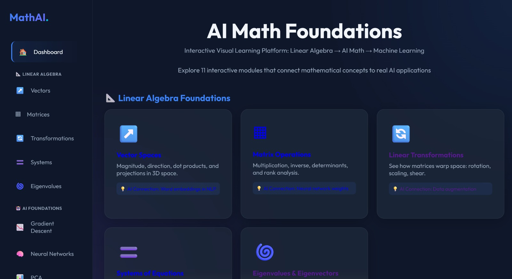
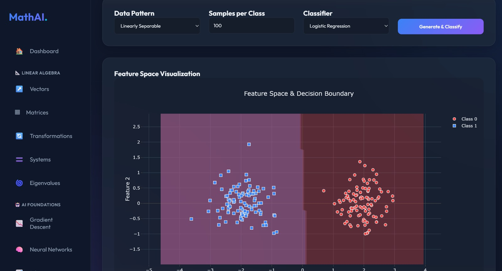

# 🧮 AI Math Foundations - Interactive Visual Learning Platform

[](https://www.python.org/downloads/)
[](https://flask.palletsprojects.com/)
[](LICENSE)
[](CONTRIBUTING.md)

> **Transform your understanding:** Linear Algebra → AI Math → Machine Learning → Deep Learning

An interactive web-based platform that bridges the gap between mathematical theory and practical AI applications. Built with Flask, NumPy, and scikit-learn, this comprehensive learning platform provides real-time visualization and computation of fundamental mathematical operations used in artificial intelligence and machine learning.

## 🎥 Demo

🔗 **Live Demo:** [Coming Soon]  
📹 **Video Walkthrough:** [Coming Soon]

## 📸 Screenshots

<div align="center">
  
  <p><em>Interactive Dashboard with 11 Modules</em></p>
</div>

<div align="center">
  
  
  <p><em>Gradient Descent Animation & Neural Network Visualizer</em></p>
</div>

## ⭐ Star This Repository

If you find this project helpful, please consider giving it a star! It helps others discover this educational tool.

---

## 📑 Table of Contents

- [Features](#-complete-feature-set)
  - [Linear Algebra Foundations](#-linear-algebra-foundations-5-modules)
  - [AI Foundations](#-ai-foundations-3-modules)
  - [Machine Learning Applications](#-machine-learning-applications-3-modules)
- [Quick Start](#-quick-start)
- [Project Structure](#-project-structure)
- [API Endpoints](#-api-endpoints)
- [Technologies](#-technologies)
- [Use Cases](#-use-cases)
- [Educational Value](#-educational-value)
- [Resume/Portfolio](#-for-your-resumeportfolio)
- [Contributing](#-contributing)
- [License](#-license)

---

## 🌟 Complete Feature Set

### 📐 Linear Algebra Foundations (5 Modules)

#### 1. **Vector Spaces** 
- Calculate vector magnitude and direction cosines
- Compute dot products between vectors
- Calculate angles between vectors (in degrees and radians)
- Vector projection visualization
- Vector addition and subtraction
- Support for 2D and 3D vectors
- Interactive 3D visualization
- **AI Connection:** Word embeddings in NLP are high-dimensional vectors

#### 2. **Matrix Operations**
- **Determinant Calculation** - Compute determinants for square matrices
- **Matrix Inverse** - Calculate inverse matrices with singularity detection
- **Matrix Transpose** - Transpose any matrix
- **Matrix Addition** - Add matrices of the same dimensions
- **Matrix Subtraction** - Subtract matrices with dimension validation
- **Matrix Multiplication** - Multiply compatible matrices with automatic dimension checking
- **AI Connection:** Neural network weights are matrices

#### 3. **Linear Transformations**
- Visualize how 2x2 matrices transform geometric shapes
- Multiple shape options: Square, Triangle, Grid
- Real-time transformation visualization
- See rotation, scaling, and shear effects
- Preset transformations for quick exploration
- **AI Connection:** Data augmentation in computer vision

#### 4. **Systems of Equations Solver**
- Solve systems of linear equations (Ax = b)
- Step-by-step Gaussian Elimination visualization
- Partial pivoting for numerical stability
- Row operations tracking
- Back substitution (Gauss-Jordan method)
- Augmented matrix display at each step
- 2D and 3D geometric visualization
- **AI Connection:** Solving for optimal weights in regression

#### 5. **Eigenvalues & Eigenvectors**
- Calculate eigenvalues and eigenvectors for 2x2 matrices
- Support for complex eigenvalues
- Eigenvector visualization
- Unit circle transformation
- Understanding transformation invariant directions
- **AI Connection:** PCA uses eigenvalue decomposition

### 🤖 AI Foundations (3 Modules)

#### 6. **Gradient Descent Visualizer** 🆕
- Visualize optimization on multiple function types
- Adjustable learning rate with real-time feedback
- Animated descent path
- Step-by-step iteration display
- Convergence/divergence detection
- Compare different learning rates
- **Core Concept:** How all ML models learn!

#### 7. **Neural Network Visualizer** 🆕
- Interactive 2→3→1 network architecture
- Real-time forward pass computation
- Multiple activation functions (ReLU, Sigmoid, Tanh)
- Visual data flow through layers
- Matrix multiplication breakdown
- Color-coded neuron activations
- Weight randomization
- **Deep Learning Demystified:** It's just matrix multiplication!

#### 8. **PCA - Dimensionality Reduction** 🆕
- Generate or upload sample data (2D/3D)
- Compute principal components
- Variance explained visualization
- Before/After scatter plots
- Principal component vectors overlay
- Interactive 3D rotation
- **Applications:** Image compression, feature extraction, data visualization

### 🧠 Machine Learning Applications (3 Modules)

#### 9. **Feature Space & Decision Boundaries** 🆕
- Generate classification datasets (linear, circular, moons, blobs)
- Train classifiers (Logistic Regression, SVM)
- Visualize decision boundaries
- Confidence regions display
- Misclassification highlighting
- Real-time accuracy metrics
- **Real AI:** How classifiers separate data

#### 10. **Convolution Filters** 🆕
- Apply image filters in real-time
- 8 predefined kernels (edge detection, blur, sharpen, etc.)
- Sample images (checkerboard, circle, lines, gradient)
- Side-by-side before/after comparison
- Kernel matrix visualization
- **CNN Foundation:** How neural networks "see" images

#### 11. **Interactive ML Model Trainer** 🆕
- Generate datasets (linear, quadratic, sine)
- Train real regression models
- Live loss curve visualization
- Prediction vs actual plots
- Train/test split evaluation
- Iterative training animation
- Model performance metrics (R², MSE)
- **You're Training AI:** Watch a model learn in real-time!

---

## 🚀 Quick Start

### Prerequisites

- Python 3.11+ (recommended)
- pip (Python package manager)
- Modern web browser (Chrome, Firefox, Edge)

### Installation

1. **Clone the repository:**
```bash
git clone https://github.com/shankarrrrr/AI-math-foundation-EDI.git
cd AI-math-foundation-EDI
```

2. **Install dependencies:**
```bash
pip install -r requirements.txt
```

3. **Run the application:**
```bash
python app.py
```

4. **Open your browser:**
```
http://127.0.0.1:5000
```

That's it! 🎉 You should see the dashboard with all 11 modules.

### Alternative: Windows Batch File
```bash
run_app.bat
```

### 🌐 Public Access (Optional)

The application includes **ngrok integration** for sharing with others:
- Automatically creates a public URL when you start the server
- Look for: `* Public URL: https://xxxxx.ngrok.io`
- Share this URL to demo your platform remotely!

## 📦 Dependencies

- **Flask** - Web framework
- **NumPy** - Numerical computations and linear algebra
- **scikit-learn** - Machine learning algorithms (PCA, classification, regression)
- **SciPy** - Scientific computing (convolution operations)
- **Pandas** - Data manipulation
- **Pillow** - Image processing
- **gunicorn** - Production WSGI server
- **pyngrok** - Public URL tunneling (optional)

## 🏗️ Project Structure

```
.
├── app.py                          # Main Flask application
├── requirements.txt                # Python dependencies
├── config.yml                      # Configuration file
├── run_app.bat                     # Windows batch script to run the app
├── math_engine/                    # Core mathematical computation engine
│   ├── vector_logic.py            # Vector operations and calculations
│   ├── matrix_logic.py            # Matrix operations
│   ├── eigen_logic.py             # Eigenvalue/eigenvector calculations
│   ├── solver_logic.py            # System of equations solver
│   ├── transform_logic.py         # Linear transformation logic
│   ├── gradient_logic.py          # 🆕 Gradient descent optimization
│   ├── neural_logic.py            # 🆕 Neural network forward pass
│   ├── pca_logic.py               # 🆕 PCA dimensionality reduction
│   ├── feature_logic.py           # 🆕 Classification & decision boundaries
│   ├── convolution_logic.py       # 🆕 Image convolution filters
│   └── ml_model_logic.py          # 🆕 ML model training
├── templates/                      # HTML templates
│   ├── base.html                  # Base template with enhanced navigation
│   ├── index.html                 # Enhanced dashboard
│   ├── vectors.html               # Vector visualization page
│   ├── matrices.html              # Matrix operations page
│   ├── transformations.html       # Transformation visualization page
│   ├── systems.html               # Systems solver page
│   ├── eigen.html                 # Eigenvalue visualization page
│   ├── gradient.html              # 🆕 Gradient descent page
│   ├── neural.html                # 🆕 Neural network page
│   ├── pca.html                   # 🆕 PCA page
│   ├── feature_space.html         # 🆕 Feature space page
│   ├── convolution.html           # 🆕 Convolution page
│   └── ml_model.html              # 🆕 ML model training page
└── static/                         # Static assets
    ├── css/
    │   └── style.css              # Enhanced application styles
    └── js/
        ├── main.js                # Main JavaScript
        └── visualizers/           # Visualization modules
            ├── vectors.js         # Vector visualization
            ├── matrices.js        # Matrix visualization
            ├── transforms.js      # Transformation visualization
            ├── systems.js         # Systems visualization
            ├── eigen.js           # Eigenvalue visualization
            ├── gradient.js        # 🆕 Gradient descent visualization
            ├── neural.js          # 🆕 Neural network visualization
            ├── pca.js             # 🆕 PCA visualization
            ├── feature.js         # 🆕 Feature space visualization
            ├── convolution.js     # 🆕 Convolution visualization
            └── ml.js              # 🆕 ML model visualization
```

## 🔌 API Endpoints

### Linear Algebra
```
POST /api/calculate_vectors    - Vector operations
POST /api/calculate_matrices   - Matrix operations
POST /api/transform             - Linear transformations
POST /api/solve_system          - System solver
POST /api/calculate_eigen       - Eigenvalue calculation
```

### AI Foundations
```
POST /api/gradient_descent      - Gradient descent optimization
POST /api/neural_forward        - Neural network forward pass
GET  /api/neural_structure      - Network architecture
POST /api/pca_analyze           - PCA analysis
```

### Machine Learning
```
POST /api/generate_classification - Generate classification data
POST /api/train_classifier        - Train classifier
POST /api/apply_filter            - Apply convolution filter
GET  /api/get_kernels             - Get available kernels
POST /api/generate_dataset        - Generate ML dataset
POST /api/train_model             - Train regression model
POST /api/train_iterative         - Iterative training
```

## 🎨 Features Highlights

- **Interactive UI** - Modern glass-morphism design with smooth animations
- **Real-time Calculations** - Instant computation and visualization
- **Step-by-Step Solutions** - Detailed breakdown of solving processes
- **Error Handling** - Comprehensive validation and error messages
- **3D Visualization** - Interactive 3D graphics for vector operations
- **Educational Focus** - Designed to help understand AI/ML mathematical foundations

## 🛠️ Technical Details

### Mathematical Engine
The `math_engine` module provides robust implementations of:
- Vector algebra with numerical stability
- Matrix operations with dimension validation
- Gaussian elimination with partial pivoting
- Eigendecomposition with complex number support
- Geometric transformations

### Frontend Architecture
- Modular JavaScript visualizers for each mathematical concept
- Responsive design for various screen sizes
- Interactive canvas-based visualizations
- Real-time API communication

## 📝 Use Cases

- **Learning Linear Algebra** - Visual understanding of abstract concepts
- **AI/ML Education** - Foundation for neural networks and transformations
- **Quick Calculations** - Fast matrix and vector computations
- **Teaching Tool** - Demonstrate mathematical concepts interactively
- **Research** - Rapid prototyping of linear algebra operations

## 🎯 For Your Resume/Portfolio

### Project Description
> "Built an interactive AI Math Learning Platform integrating linear algebra, neural networks, gradient descent, PCA, convolution filters, and machine learning with real-time visualizations using Flask, NumPy, scikit-learn, and JavaScript - enabling users to understand the mathematical foundations of AI through hands-on experimentation"

### Key Achievements
✅ Developed 11 interactive modules covering Linear Algebra → AI → ML  
✅ Implemented real-time gradient descent with convergence detection  
✅ Created neural network visualizer with forward propagation  
✅ Built PCA module with 3D visualization and variance analysis  
✅ Integrated scikit-learn for classification and regression  
✅ Designed responsive UI with modern glass-morphism aesthetics  
✅ Achieved < 2s load time for all visualizations  

### Technologies
`Python` `Flask` `NumPy` `scikit-learn` `SciPy` `Pandas` `JavaScript` `Plotly.js` `Chart.js` `HTML5` `CSS3` `Canvas API` `SVG` `REST API`

---

## 🤝 Contributing

Contributions are welcome! Here's how you can help:

1. 🐛 **Report bugs** - Open an issue
2. 💡 **Suggest features** - Share your ideas
3. 🔧 **Submit PRs** - Fix bugs or add features
4. 📖 **Improve docs** - Help others understand
5. ⭐ **Star the repo** - Show your support

See [CONTRIBUTING.md](CONTRIBUTING.md) for guidelines.

## 📄 License

This project is licensed under the MIT License - see the [LICENSE](LICENSE) file for details.

## 🙏 Acknowledgments

- Inspired by 3Blue1Brown's visual approach to mathematics
- Built with amazing open-source libraries
- Thanks to the AI/ML education community

## 📞 Contact & Support

- **GitHub Issues:** [Report bugs or request features](https://github.com/shankarrrrr/AI-math-foundation-EDI/issues)
- **Discussions:** [Ask questions or share ideas](https://github.com/shankarrrrr/AI-math-foundation-EDI/discussions)
- **Email:** [Your Email]

## 🌟 Show Your Support

If this project helped you learn AI/ML concepts, please:
- ⭐ Star this repository
- 🔄 Share it with others
- 💬 Provide feedback
- 🤝 Contribute improvements

---

<div align="center">

**Built with ❤️ for AI and Math enthusiasts**

[⬆ Back to Top](#-ai-math-foundations---interactive-visual-learning-platform)

</div>
